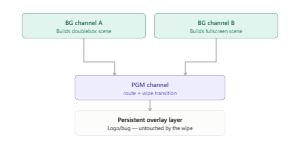

# ADR 0002: Pre-build wipe scenes on background Caspar channels

**Status:** Accepted (target architecture — not yet implemented in blueprints)
**Date:** 2026-09-03
**Repos affected:** `tojemoc/sofie-demo-blueprints` (primary), Caspar `caspar.config`,
megarepo docs (`OUTPUT_TOPOLOGY`, `DOUBLEBOX-PGM`)
**Owner:** SPRÁVY playout

## Context

Today DoubleBox, fullscreen SYN/VT, camera, HTML L3Ds, and alpha wipes all live as
**layers on the same PGM channel** (default Caspar ch2). On Take with a wipe piece,
Sofie fires `PLAY`/`CG ADD` for the next scene's layers **at the same time** as the
wipe overlay on layer 200.

Those producers have very different, non-deterministic load times:

| Producer | Typical latency on Take |
|----------|-------------------------|
| DeckLink / `dshow://` camera | Already live (~0) |
| PNG / still | Fast decode |
| FFmpeg clip | Open + decode first frames |
| HTML / CEF template | Slowest — load, JS, settle animation |

The wipe motion is a fixed ~2.5s; HTML settles whenever CEF finishes. Result: **elements
pop in mid-wipe** (operators report DoubleBox graphics last). That is two independent
clocks overlapping, not a Caspar bug.

## Decision

Treat story-block wipes as **definite transitions between pre-built scenes**, not as
overlays racing layer loads on PGM:

```text
BG channel A ──Builds doublebox scene──┐
                                       ├──► PGM channel (route + wipe transition)
BG channel B ──Builds fullscreen scene─┘
                                              │
                                              ▼
                                    Persistent overlay layer
                                    (Logo/bug — untouched by the wipe)
```



1. **Background channels** (no SDI/Screen consumers required) continuously composite the
   *current* and *next* story looks (DoubleBox vs fullscreen SYN/weather/etc.).
2. **PGM** only **routes** (`route://`) from the active BG channel and runs the wipe as an
   AMCP transition wrapping that route producer — sampling already-rendered frames.
3. **Persistent overlays** (logo-bug, optionally long-lived L3Ds that must survive the wipe)
   sit on **PGM layers above the routed bus**, never baked into both BG composites.

This is the standard broadcast “build off-air, then punch up” pattern (preview bus /
CG pre-render). Caspar’s transition producer wraps generic producers including
`route://`; asset loading moves **before** the deterministic wipe.

## Consequences

### Positive

- Wipe no longer races CEF / clip cue — pop-in during transition goes away.
- One readiness gate per Take: “has the next BG channel settled?” instead of
  coordinating N layers mid-wipe.
- Logo/bug (and similar) survive untouched if kept above the route layer.

### Costs / risks

- **Idle GPU/CPU:** 2–3 channels render full composites continuously (BG A, BG B, PGM).
  No extra *consumers* on BG channels — only render cost. Measure headroom at production
  resolution before locking channel count.
- **Lookahead:** Sofie must schedule next-BG build with enough preroll before Take
  (HTML settle + clip cue). Prefer explicit preroll on wipe/part adapters over hoping
  WithinPart loads finish in time.
- **Mapping churn:** hypercomposed studio gains BG channel ids; DoubleBox FILL/L3D
  targets move from PGM layers to BG channel layers; wipe stops being a pure overlay on
  200 and becomes a route transition (or route + transition media).

### Non-goals (this ADR)

- Changing LED channel 1 allow-list (`bg_loop` + headline ILU).
- Replacing hard cuts (ILU→SYN without wipe in smoke) — those stay cuts unless a wipe
  piece is present.
- Vision-mixer program cuts — still Caspar-only hypercompose.

## Implementation sketch

Canonical handoff for blueprints work:
[`docs/integration/handoffs/blueprints-wipe-route-bg-channels.md`](../integration/handoffs/blueprints-wipe-route-bg-channels.md).

Suggested default channel map (overridable in studio config):

| Role | Default Caspar channel | Consumers |
|------|------------------------:|-----------|
| LED | 1 | Screen / NDI / SDI |
| PGM | 2 | Screen / NDI / SDI |
| BG A (e.g. DoubleBox look) | 3 | none (render only) |
| BG B (e.g. fullscreen look) | 4 | none (render only) |

PGM layer stack (conceptual):

```text
210  Intro / outro (may stay PGM-local or move later)
123  logo-bug / persistent overlays   ◄── above wipe
110  route://N-10  (+ wipe transition) ◄── punched-up BG composite
```

BG A/B reuse today’s DoubleBox / fullscreen layer geometry (110/115/116/118/121), but
addressed on channels 3/4.

## Alternatives considered

1. **Keep overlay wipe on PGM 200; add long preroll on HTML/clips** — still races if Take
   is early; doesn’t guarantee CEF settle before wipe midpoint.
2. **Stinger that covers load** — hides pop-in but still rebuilds under the cover; worse
   for mid-wipe reveals and doesn’t fix asymmetric load.
3. **Second Caspar server** — unnecessary; one server already hosts multiple channels.

## References

- Current topology: [`OUTPUT_TOPOLOGY.md`](../integration/OUTPUT_TOPOLOGY.md)
- DoubleBox / wipe labels today: [`DOUBLEBOX-PGM.md`](../integration/DOUBLEBOX-PGM.md)
- Buffer notes when compositing HTML+cam on one channel: [`CASPAR-FFMPEG-BUFFERS.md`](../integration/CASPAR-FFMPEG-BUFFERS.md)
